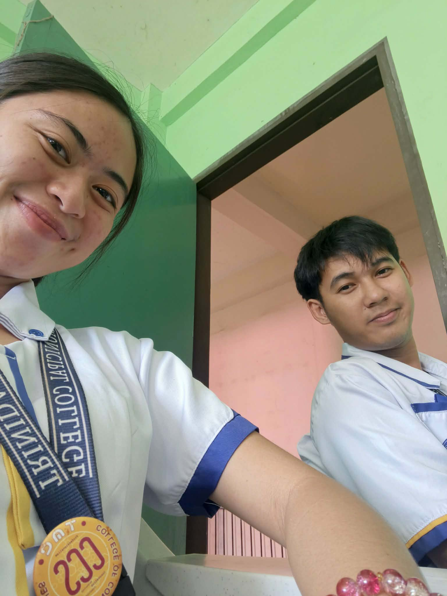
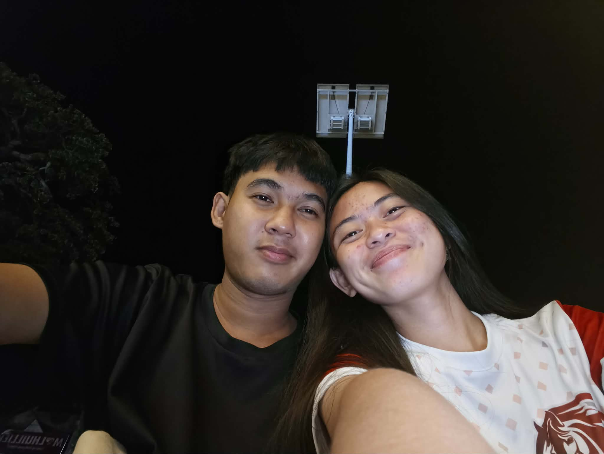
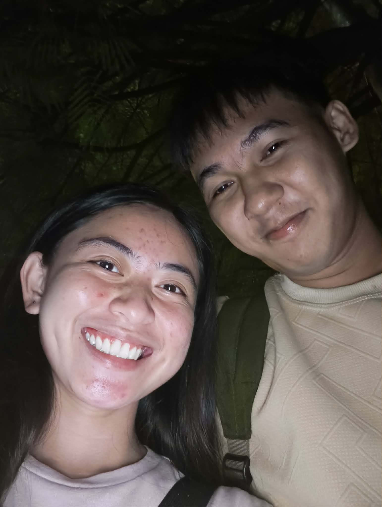
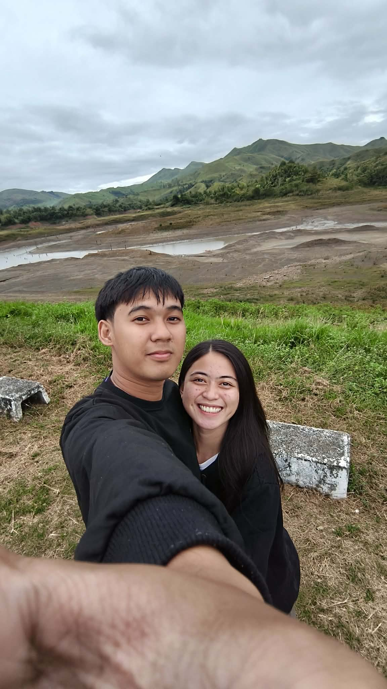
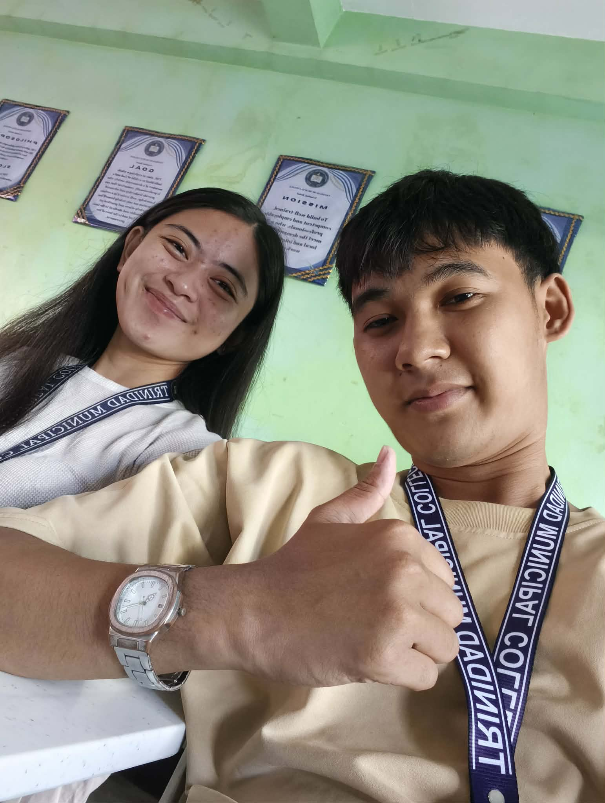
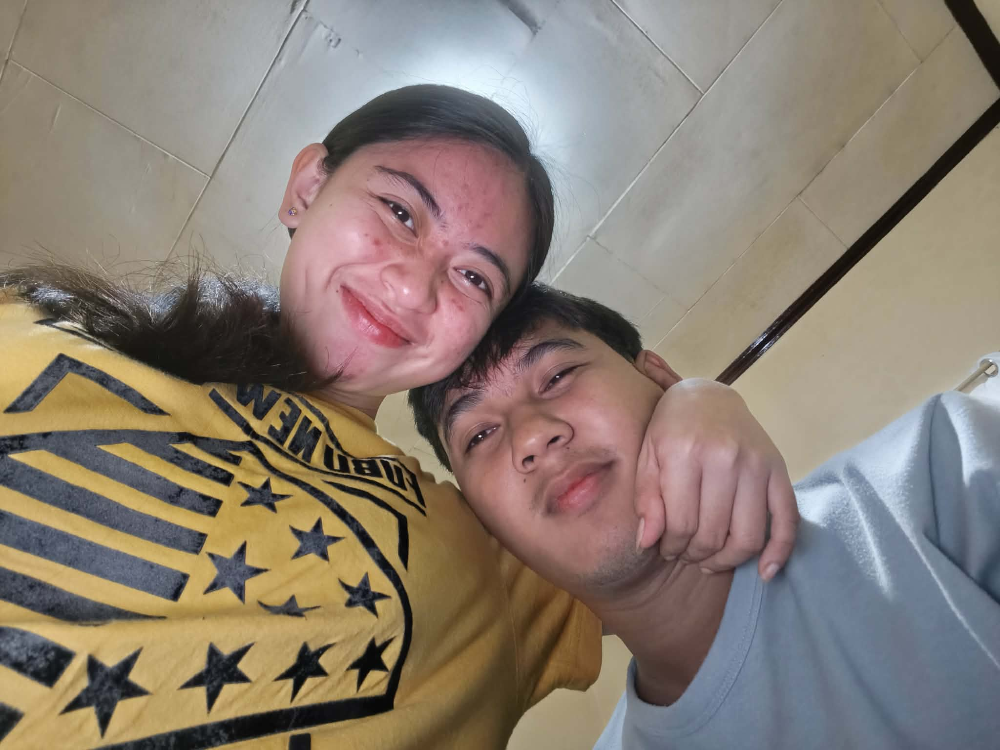
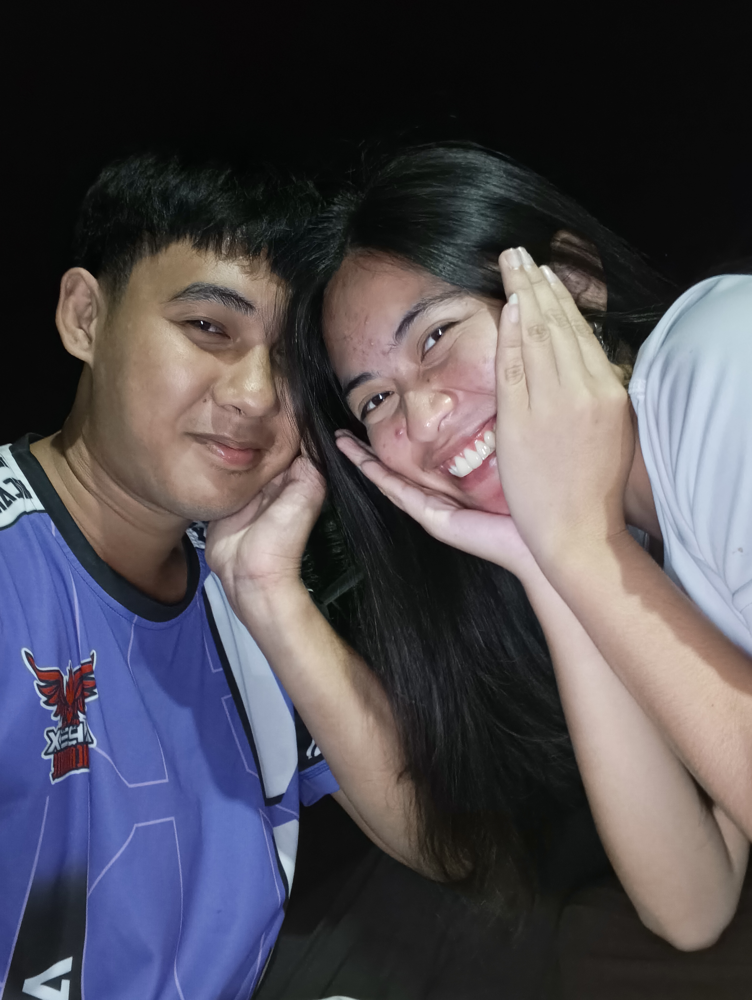
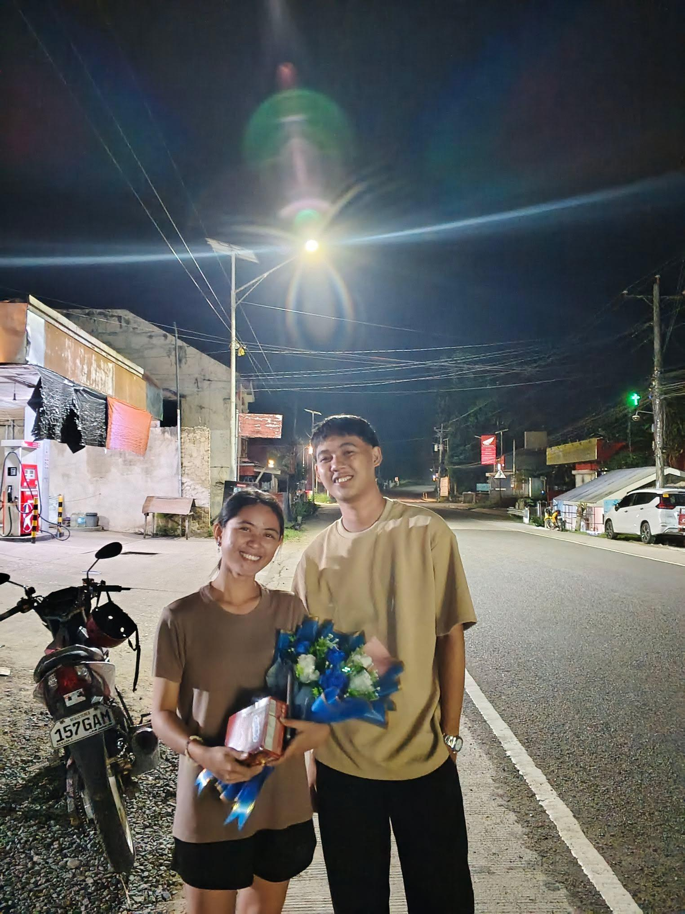

  <!DOCTYPE html>
<html>
<head>
  <title>For You 💜</title>
  <meta name="viewport" content="width=device-width, initial-scale=1.0">

  
</head>

<body>

<!-- LOGIN -->

  <h1>💜</h1>
  
Enter our callsign

  <input type="password" id="password">
  <button onclick="login()">Enter</button>
  

<!-- MAIN MENU -->

  <h1>THESE ARE FOR YOU ❤️</h1>
  
I hope you like it… I love you 💜

  

    
📸 Photos

    
💌 Love Letter

    
🎵 Our Song

    
🔐 Special

  

<!-- 📸 PHOTOS PAGE -->

  <h1>Our Memories 💜</h1>

  
  
  
  
  
  
  
  
  
  

  <audio controls autoplay loop>
    <source src="music.mp3">
  </audio>

  <button class="back" onclick="goBack()">Return 💜</button>

<!-- 💌 LETTER PAGE -->

  <h1>My Love Letter 💜</h1>

  

    My love,
    you are the best thing that ever happened to me...
    I love you more than words can explain 💜
  

  <audio controls>
    <source src="voice.mp3">
  </audio>

  <button class="back" onclick="goBack()">Return 💜</button>

<!-- 🎵 SONG PAGE -->

  <h1>Our Song 💜</h1>

  

  <audio controls autoplay loop>
    <source src="song.mp3">
  </audio>

  <button class="back" onclick="goBack()">Return 💜</button>

<!-- 🔐 SPECIAL PAGE -->

  <h1>Special 💜</h1>
  
Do you want to continue?

  <button onclick="showPin()">Yes 💜</button>

<!-- PIN -->

  <h1>Enter PIN</h1>
  <input type="password" id="pin">
  <button onclick="checkPin()">Unlock</button>

<!-- FINAL -->

  <h1>💜</h1>
  <button onclick="showFinal()">Tap Me 💜</button>
  

    Marked this day as our anniversary 💜
  

  <button class="back" onclick="goBack()">Return 💜</button>

</body>
</html>

